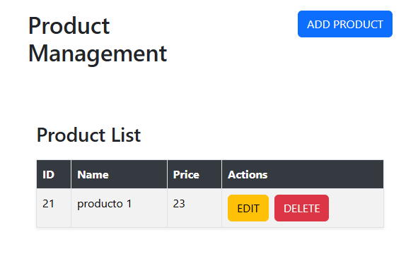
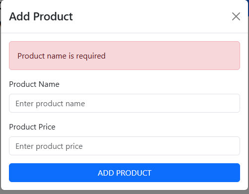
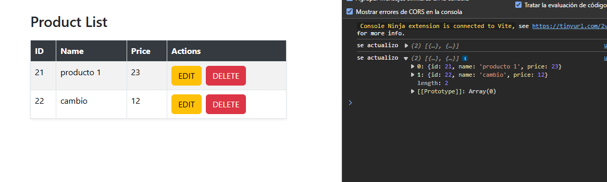
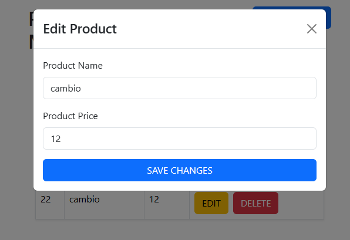
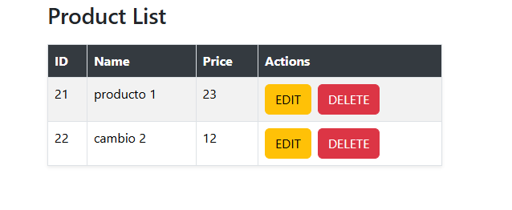
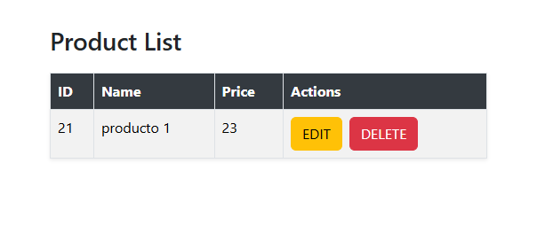

Configuración y Ejecución del Proyecto React

git clone https://github.com/CristhoferDaniel/product-frontend.git
cd product-frontend

Instalar Dependencias
npm install

iniciar proyecto
npm run dev

Captura de pantalla de la página principal con la lista de productos y opciones de edición y eliminación.

validaciones 

Captura de pantalla del formulario utilizado para agregar un nuevo producto a la base de datos.

Captura de pantalla del formulario utilizado para editar un producto existente.

Captura de pantalla de la pagina principal eliminando un producto.

Estructura del Proyecto
El proyecto está organizado de manera estructurada y modular, facilitando el desarrollo, mantenimiento y escalabilidad de la aplicación. A continuación, se detallan los principales directorios y su función dentro del proyecto de gestión de productos:

components
En el directorio components se encuentran todos los componentes reutilizables de React utilizados en la interfaz de usuario. Estos componentes están diseñados para ser independientes y modulares, lo que facilita su uso en diferentes partes de la aplicación. Ejemplos de componentes incluidos son:
addProduct: Formulario para agregar  productos.
EditProductModal:  Formulario para  editar productos.

hooks
El directorio hooks contiene hooks personalizados que encapsulan la lógica compleja y reutilizable de la aplicación. Estos hooks ayudan a mantener un código limpio y modular, separando la lógica del componente de su presentación. Algunos ejemplos de hooks utilizados en el proyecto son:
useProducts: Hook para gestionar el estado y las operaciones relacionadas con los productos, como agregar, editar, eliminar y obtener productos.
donde se encuentran algunas funciones como :
fetchProducts: Función para obtener la lista de productos desde el servidor backend.
addProduct: Función para agregar un nuevo producto a la base de datos.
updateProduct: Función para actualizar los detalles de un producto existente.
deleteProduct: Función para eliminar un producto de la base de datos.

utils
El directorio utils contiene utilidades y funciones de ayuda que son utilizadas en diversas partes del proyecto. Estas funciones proporcionan funcionalidades comunes y ayudan a mantener un código limpio y eficiente. Algunas utilidades incluidas son:
validation: Función de validación que verifica si los datos ingresados en el formulario de productos cumplen con ciertos criterios (por ejemplo, nombre no vacío y precio numérico positivo).

productService
En el directorio services, el servicio productService contendrá funciones dedicadas a interactuar con el backend para gestionar productos. A continuación, te mostraré cómo podrías estructurar estas funciones:

fetchProducts: Obtener la lista de productos desde el backend.
addProduct: Agregar un nuevo producto en la base de datos.
updateProduct: Actualizar los detalles de un producto existente.
deleteProduct: Eliminar un producto de la base de datos.